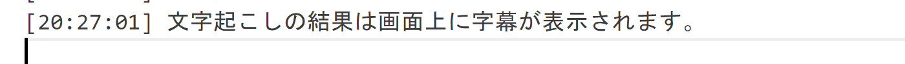
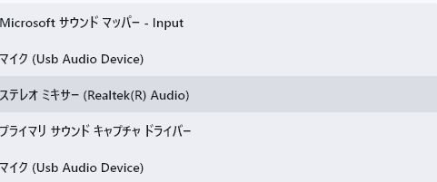
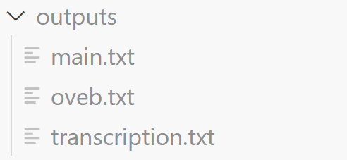
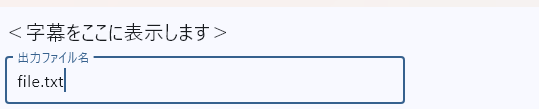

# リアルタイム議事録生成

OpenAI の Whisper と [flet](https://flet.dev/) を使って、マイクやPC上で再生される音声をリアルタイムに文字起こしするアプリです。録音結果は画面に字幕表示され、ファイルにも自動保存されます。

マイクで使うよりもステレオミキサーを使って、PC上の音を文字起こしする目的で作成しました。

## 出力結果の例

## 使い方

### バッチファイル

バッチファイルから動作させることができます。ただし、仮想環境の Python 実行ファイルパスを指定してください。

### デバイスの選択

次のように、PC上のデバイスを選択することができます。

### 録音結果

録音結果はoutputsというフォルダ上に保存されます。

ファイル名も指定することができます。

## 録音結果に変な文章が混ざる場合
config.jsonのsilence_threshold を設定してみましょう。

silence_threshold は、録音中に 「無音」と判断する基準を設定するパラメータです。
音声ブロックの平均音量がこの値より小さいと、そのブロックは「無音」とみなされて文字起こしの対象から除外されます。